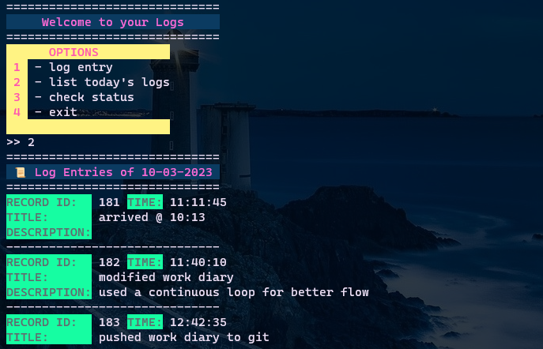

# WorkDiary

A commandline tool made with python used to create logs in a `SQLite3` database and export those logs in csv format.

## Installation

It only has simple functionality created using built-in python libraries.

## Usage

- For help using this tool
```
python3 log.py -h
```
- Start the main function. It has several options including: Create a log entry, print logs, check status etc
```
python3 log.py
```
or alternatively you can use
```
python3 log.py log
```
- To export all entries to `.csv`
```
python3 log.py export-all
```
- To export entries related to a specific date to `.csv`
```
python3 log.py export-date -d dd-mm-yyyy
```
or alternatively you can use
```
python3 log.py export-date -date dd-mm-yyyy
```
replace the dd-mm-yyyy with your own specific date

- To get visualizations of your records in csv file
```
python3 visualize.py
```
## Preview

## Note

This is still a prototype and I'm planning to include more functionality like GUI

## Further Development
- [ ] export logs to cloud storage
- [ ] retrieve logs from cloud storage
- [ ] add "logtype" field to database (used for log classification while data munging)
- [ ] add GUI support (probably `PySimpleGUI` for now)